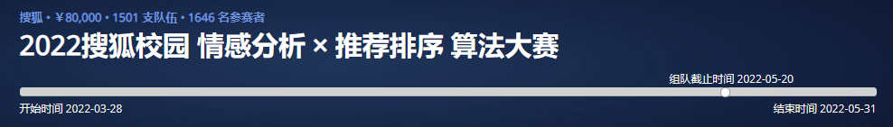

# 2022-Sohu-Competition

**2022搜狐校园 情感分析x推荐排序 算法大赛解决方案分享 - 决赛成绩第9名**

**如有问题欢迎issue讨论，若有帮助点点↗star~**

链接：https://www.biendata.xyz/competition/sohu_2022/

---

## Task1: Sentiment-Analysis-Solution

### 问题分析

本问题属于 **Aspect Based Sentiment Analysis(ABSA)** 任务，给定一段新闻以及若干实体，要求预测对应实体的情感特征（-2~2）

- 难点一：过长文本表示

- 难点二：情感标签极不均衡（样本整体0标签极多，2和-2标签极少）

- 难点三：实体的情感标签分布不均（不同实体在不同语境中情感特征不同，且该分布差异化大）

### 现有解决方案

1. Baseline：拆分样本，每篇文章对应一个实体，进行 text pair 分类任务
   - 缺点：分割了实体序列，无法捕获实体的情感特征间的信息；训练&推理效率低下

2. Prompt Finetune：不拆分样本，为每篇文章构造 prompt ，使用 MLM Model 预测 mask token，然后将该 token 映射回情感标签
   - 缺点：待预测字段在最前面，可能远离实体的上下文；
   - 基于谷歌的 *The Power of Scale for Parameter-Efficient Prompt Tuning* 一文可以看到，在强监督学习的任务中，精心设计了 finetune task 的模型表现可以强于 prompt-tuning 的。

### 我们的解决方案

#### 数据预处理（难点一）

设计了两种content采样策略

1. **mean span content sample**

   思路：对于每一个实体采样其前后n个字符，最后对采样结果进行合并&拼接
   n = maxLen / entityCnt / 2

2. **BM25 sample**

   思路：基于BM25检索算法，把实体名的拼接作为query，把content的每个句子作为candidate，计算候选句对于query的相关性，保留相关最高的句子。

   实验过程中发现，虽然BM25采样可以得到与query实体整体相关度最高的句子，但是容易出现离群实体缺失的情况，方案中最终使用的采样算法为 mean span content sample。

#### 模型设计

1. **Sequence Labeling**: 序列标注模型
   将ABSA问题构造成序列标注问题，具体来说，可以看成已知实体位置，对实体type进行分类；本问题中的type即为情感标签

   优点：
      - 有效建模实体上下文（预测结果为实体在content中多处的情感标签）
      - 有效建模实体情感标签间的信息

2. **Mask Entity Labeling**: 掩盖实体序列标注模型
   - 思路：case中发现，序列标注模型有时会过于依赖实体本身的特征，而不是实体的上下文特征（难点三）。对此，我希望模型可以不那么依赖具体实体来对其情感特征进行判断，而仅去关注实体的上下文

   - 做法：在tokenizer中加入 `[et0]` ~ `[et30]` 标记，将原文中的实体替换成这些标记后再送入序列标注模型进行预测。

   - 我们认为，这样的操作可以达到类似于Bert预训练`[mask]`标记的效果；经过大量语料的训练后，`[et]` 标记所得到embedding便可以很好的表征该位置实体的情感特征。

   - 优点：降低模型对实体的特征的依赖，关注上下文特征；增强鲁棒性。
  
#### 训练策略

观察到样本中的情感特征标签分布极不均衡（难点二），我们设计了 **Weighted Loss** & **Weighted Batch** 两种策略来进行优化。

1. Weighted CrossEntropyLoss

   在CrossEntropyLoss函数的weight参数中设置label权重

   对比 `non-weight CrossEntropyLoss`、`Weighted CrossEntropyLoss`、`Focal Loss`后发现，加权交叉熵效果最好。

   **采用的权重设置**
   | 标签 | 权重 |
   | :--- | :--- |
   | -2   | 2    |
   | -1   | 1    |
   | 0    | 0.5  |
   | 1    | 1    |
   | 2    | 3    |

2. Weighted Batch

   在CrossEntropyLoss函数中给每个batch的loss乘上一个weight矩阵，用以衡量batch中不同样本的重要性。

   weight 计算：基于训练数据实体标签的统计特征
   - 实体词频权重：词频越小的实体越重要
   - 样本标签方差权重：样本标签分布越不均的实体越重要
   - 实体情感偏差权重：实体平均情感值越偏离0越重要
      （样本权重为其所有实体权重的均值）
   
   （在后续的实验中发现这一部分带来负效果，最后的方案中没有使用）

3. Ignore Index Loss

   在Bert的实现过程中，其交叉熵损失是仅计算mask部分的loss总和；在掩盖实体序列标注模型中也采用了这种设置（仅计算`[et]`的loss）。

#### Domain Adaptation Pretrain

使用所有的NLP赛道的content，对`ernie-gram-zh`和`chinese-roberta-wwm-ext`预训练模型做继续训练，分别练了8epoch和16epoch。

但是实验发现提升效果很少，F1提升了0.1左右。

#### 整体方案
   - 训练集验证集划分：取5%初赛训练集合10%复赛训练集作为valid dataset（约为总数据的6%）
   - 使用继续训练后的roberta-base和ernie-gram分别训练了SeqLabel Model和Mask SeqLabel Model（共四个模型）
   - SeqLabel Model两者取均值，Mask SeqLabel Model两者取均值，然后再以0.9:0.1的比例集成

---

## Task2: News-Recommendation-Solution

### 概述

本部分我们简单的采用将所有的特征提前处理成稀疏特征，然后使用DeepCtr的DIFM模型对特征进行分类。

特征工程主要分为三个部分：query特征、历史特征和分组特征。

### 特征工程

- query特征

   | 特征名                       | 描述                     |
   | :--------------------------- | :---------------------- |
   | `province``city``deviceType` | 原数据中的特征           |
   | `Hour`                       | 时间戳的真实时间的小时数 |

- 历史特征

   | 特征名       | 描述                                                              |
   | :----------- | :------------------------------------------------------------ |
   | `bm25`       | 召回文章实体作为query对历史文章实体计算BM25得分，即历史喜好相似度  |
   | `bm25Len`    | 有效历史文章数                                                  |
   | `co_bm25`    | 历史实体之间的BM25相似度，衡量用户的喜好多寡                      |
   | `historyHit` | 召回文章在所有用户历史中的点击次数                                |
   | `gongxian`   | 召回文章实体在用户历史实体中的共现次数                            |
   | `gapMeanEmotion`   |  重叠实体情感值之差的绝对值之和，衡量用户对文章的情感偏好     |

- 分组特征

   | 特征名      | 描述                                             |
   | :---------- | :----------------------------------------------- |
   | `logTs_gap` | 距每组按时间排序的第一个样本的时间间隔（单位秒）  |
   | `groupLen`  | 分组长度                                      |
   | `bm25_mean`  | 分组BM25均值                                  |
   | `co_bm25_mean`  | 分组co_BM25均值                            |
   | `historyHitSort`  | 分组中每篇文章对历史点击率的排序           |

---

## 代码结构&运行说明

### 训练

- Sentiment-Analysis/seqLabeling: 序列标注模型、掩盖实体序列标注模型训练、预训练模型继续预训练代码

- Recommendation/推荐模型-DeepCTR & CatBoost.ipynb: 推荐模型训练代码

### 推理

./submitModel/inference.ipynb
推理代码，修改CFG中的test_file、rec_test分别为复赛测试数据地址，运行全部，即可在该目录下生成section1.txt、section2.txt

相关依赖：

conda install --yes --file ./submitModel/condalist.txt

### 使用的原始预训练模型

ernie-gram-zh: https://huggingface.co/nghuyong/ernie-gram-zh
roberta-base: https://huggingface.co/hfl/chinese-roberta-wwm-ext

